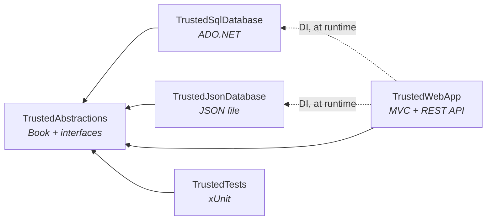

# Trusted Library

A library management system in ASP.NET Core MVC, built as an exercise in clean separation: a
domain-only abstractions library, two interchangeable storage implementations selected at runtime
through dependency injection, a service layer that both an MVC front end and a REST API sit on, and
tests at unit and integration level.

Target framework is **.NET 10**. The solution file is `TrustedFinanceLibrary.slnx`.

---

## Quick start

```bash
git clone https://github.com/batmanonabike/trusted_finance_aspnet_ado_example
cd TrustedFinance/TrustedFinanceLibrary/Projects
dotnet build TrustedFinanceLibrary.slnx
dotnet run --project TrustedWebApp
```

**It runs out of the box.** The default backing store is a JSON file, so no database setup is
required. Browse to the app, open **Library**, and use *Populate test data* to generate some rows.

The JSON store lives at `%LOCALAPPDATA%\TrustedLibrary\Json\Library.json`.

### Switching to SQL Server

Two steps:

1. Run `SQLScripts/CreateTable_Books.sql` against your instance (developed against SQL Express,
   scripted with SSMS).
2. In `TrustedWebApp/appsettings.json`, point the connection string at your instance and flip the
   toggle:

```jsonc
"ConnectionStrings": {
  "TrustedLibrary": "Server=localhost\\SQLEXPRESS;Database=trusted_finance;Trusted_Connection=True;Encrypt=True;TrustServerCertificate=True;"
},
"TrustedLibrary": {
  "UseSqlDatabase": true   // false for JSON
}
```

Nothing else changes. That is the point of the exercise — see [Dependency inversion](#dependency-inversion-and-liskov-substitution) below.

---

## Projects

| Project | Responsibility |
|---|---|
| `TrustedAbstractions` | The `Book` entity and the interfaces: `IBookRepository`, `ILibrary`, `IBookService`, `ILibraryService`. No vendor or storage specifics whatsoever. |
| `TrustedSqlDatabase` | ADO.NET implementation over `Microsoft.Data.SqlClient`. |
| `TrustedJsonDatabase` | JSON-file implementation, for zero-setup running and testing. |
| `TrustedWebApp` | ASP.NET Core MVC front end, REST API, service layer and DI wiring. |
| `TrustedTools` | Test-data generation (`BookCreator`, `BookTokenGenerator`) shared by the app and the tests. |
| `TrustedTests` | xUnit tests covering the JSON repository, the SQL repository, and the API controller. |

### Dependency direction

Everything points inward at `TrustedAbstractions`, and nothing points back out.



The solid arrows are compile-time references. The dotted ones are resolved by the container at
runtime — the web app has no compile-time knowledge of *which* store it is talking to beyond the
interface.

---

## Principles applied

### Abstraction

`TrustedAbstractions` holds the `Book` entity and a small set of interfaces and nothing else. Every
other project depends on it, and makes no assumption beyond adhering to those interfaces. There is
no mention of SQL, JSON, ADO.NET or ASP.NET anywhere in it.

### Dependency inversion and Liskov substitution

There are two complete, independent implementations of `ILibrary` / `IBookRepository` — one ADO.NET,
one JSON file. Neither knows the other exists. Both are registered in the container, and
`ServiceCollectionExtensions.AddTrustedLibrary()` resolves one or the other through a factory based
on a bound configuration option:

```csharp
private static ILibrary GetLibrary(IServiceProvider serviceProvider, bool useSqlDatabase)
{
    return useSqlDatabase ?
        serviceProvider.GetRequiredService<TrustedSqlDatabase.Library>() :
        serviceProvider.GetRequiredService<TrustedJsonDatabase.Library>();
}
```

Substituting one for the other is a config edit, not a code change, and every consumer is unaware.

### Single responsibility and loose coupling

The service layer (`BookService` / `LibraryService`) sits over the repository, and *both* front ends
sit over the service layer:

- `LibraryController` → Razor views (list, edit, delete, populate)
- `BooksController` → a genuine REST API at `api/books`

Because the API is built on the service layer rather than the views, the two are independent. Note
also that the **service interfaces are deliberately separate from the repository interfaces**
(`IBookService` is not `IBookRepository`) — they serve different consumers and are free to diverge.

In a production architecture I would likely host the API as a separate service; here it shares the
process to keep the sample self-contained.

### DRY

Applied throughout, but worth singling out the **decorator pattern used in the tests**.
`SelfCleaningLibrary` wraps any `ILibrary`, substituting a `TrackingBookRepository` that records the
id of every book created during a test. On `Dispose` it deletes exactly those rows:

```csharp
public SelfCleaningLibrary(ILibrary library, TraceOutput output)
{
    _library = library;
    _bookRepository = _library.Books;
    _bookIdTracker = new IdTracker();
    _trackingBookRepository = new TrackingBookRepository(_bookRepository, _bookIdTracker);
}
```

One teardown mechanism, written once, works against either storage implementation — because it
depends only on `ILibrary`.

### Defensive data access

The SQL repository uses parameterised queries exclusively, with explicit `SqlDbType` and column
lengths declared as constants matching the schema:

```csharp
parameters.Add("@Title", SqlDbType.NVarChar, TitleLength).Value = book.Title;
```

Inserts use `OUTPUT INSERTED.BookId` to return the identity value rather than a second round trip.
Update and delete return a `bool` from the affected row count, so callers can distinguish "not
found" from "failed" — which is what lets the API return a correct `404` versus `204`.

---

## API

`BooksController` is a conventional `[ApiController]` with declared response types throughout.

| Method | Route | Success | Failure |
|---|---|---|---|
| `GET` | `/api/books` | `200` + `List<Book>` | — |
| `GET` | `/api/books/{id}` | `200` + `Book` | `404` |
| `POST` | `/api/books` | `201` + `Location` header | `400` |
| `PUT` | `/api/books/{id}` | `204` | `400`, `404` |
| `DELETE` | `/api/books/{id}` | `204` | `404` |

`POST` returns `CreatedAtAction` so the response carries a usable `Location`. `PUT` rejects a
mismatch between the route id and the body id with `400` rather than silently trusting either.

---

## Testing

xUnit, with `Microsoft.AspNetCore.Mvc.Testing` for the integration layer.

| Suite | Covers |
|---|---|
| `JsonLibraryTests` | The JSON repository against the real file store. |
| `SqlLibraryTests` | The ADO.NET repository against a real SQL Server instance. |
| `WebAppTests` | `BooksController` end to end, over HTTP, against the app running in memory. |

```bash
dotnet test TrustedFinanceLibrary.slnx
# Passed! - Failed: 0, Passed: 30, Skipped: 0, Total: 30
```

The controller tests run the whole application in-process via
`TrustedWebAppFactory : WebApplicationFactory<TrustedWebApp.Program>`, overriding configuration to
force the JSON backend so they need no database:

```csharp
config.AddInMemoryCollection(new Dictionary<string, string?>
{
    ["TrustedLibrary:UseSqlDatabase"] = "false",
});
```

`Program` is written as an explicit class rather than top-level statements specifically so the test
factory can reference the type.

**The SQL tests need a connection string.** Edit `TrustedTests/appsettings.json` to point at your
instance and run the table script first; the JSON and controller suites run unaided.

Every test cleans up after itself through `SelfCleaningLibrary`, so runs are repeatable and leave no
residue in the database or the JSON file.

---

## Scope

This was written as a technical exercise. The brief asked for six things: a `Books` schema, an
`IBookService` interface, a single ADO.NET `BookRepository`, a short example of injecting the
service into a hypothetical controller, a static Bootstrap table, and a brief essay on clean
architecture.

### Where I went beyond the brief, deliberately

- **A second storage implementation.** Only ADO.NET was asked for. The JSON store exists to prove
  the abstraction actually holds — an interface with one implementation is an assertion, not a
  demonstration. It also means the solution runs and tests without any database setup.
- **Tests.** None were requested. There are 30, covering both repositories and the API controller
  end to end over HTTP.
- **A working REST API.** The brief wanted an interface and a hypothetical controller. This is a
  real one, with correct status codes and `Location` headers.
- **A functioning UI.** A static table was requested; edit, delete and populate are wired through.

### Out of scope, by decision

- **Authentication and authorisation** — not required by the brief, and not stubbed.
- **Input validation** — beyond `ModelState` on the edit form and `required` members on the entity.
- **Async** — the repository interface is synchronous. In production ADO.NET calls would be
  `async`/`await` throughout, and the interface shaped accordingly from the start.
- **Migrations** — a single `CREATE TABLE` script rather than a migration history.

The `Architecture` page in the running application carries a short summary of the same reasoning.
